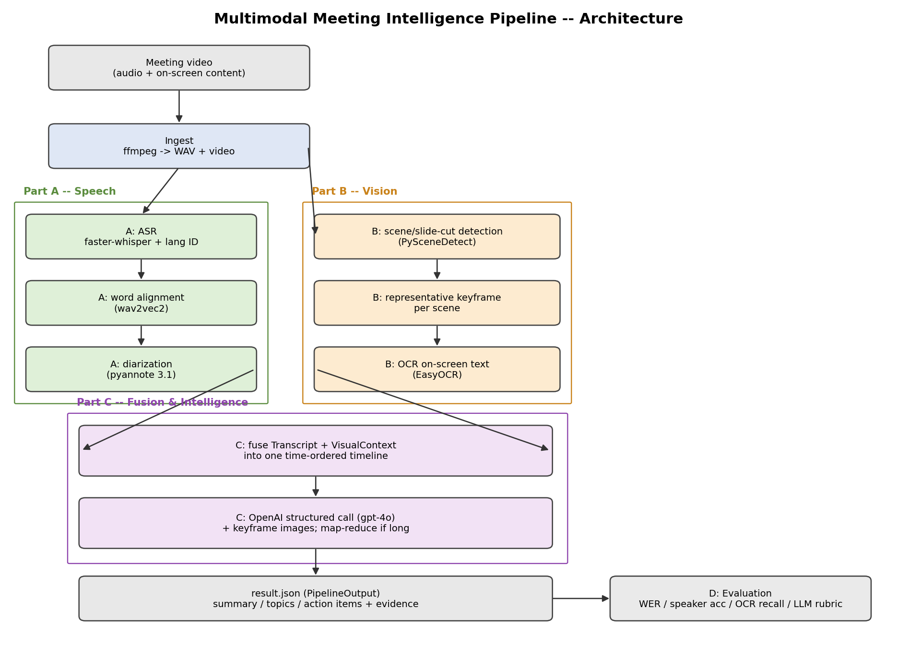

# Multimodal Meeting Intelligence Pipeline — Executive Report

*A 26-minute council-meeting recording in, a grounded, evidence-linked meeting
summary out. This report covers the architecture, key decisions, evaluation
results, failure modes, and resource footprint.*

## 1. Architecture

The pipeline is a linear cascade of independent, swappable stages connected by
explicit Pydantic data contracts ([`src/mmi/schemas.py`](../src/mmi/schemas.py)):
speech and vision run in parallel on the same source video, fuse onto one
time-ordered timeline, and are handed to an LLM that must ground every claim in
timestamped evidence.

**Design choices that matter:**

- **WhisperX + pyannote 3.1** for ASR/diarization — VAD-batched inference and
  word-level alignment give materially better speaker attribution than a naive
  faster-whisper + clustering glue, at the cost of a heavier dependency stack.
- **Scene-cut detection + one keyframe/scene (PySceneDetect + EasyOCR)** instead
  of processing every frame — captures slide content at a fraction of the cost.
- **Vision-capable LLM captioning** — rather than building a dedicated
  face/person-detection stage, representative keyframe images are attached
  directly to the `gpt-4o` call. The model reads slide text and layout from the
  image itself, which is more robust than OCR alone (see §3).
- **Strict schema output** (OpenAI structured outputs / Pydantic) instead of
  free-form text, so every summary/topic/action item carries `Evidence`
  (timestamp, speaker, scene, quote) and the result is machine-consumable.
- **Map-reduce chunking** above a configurable character budget, so meeting
  length doesn't blow the context window.
- **Disk-cached stage artifacts** (`outputs/cache/*.json`) so an expensive ASR
  pass isn't repeated while iterating on prompts or re-running only the LLM
  stage.

## 2. Model / API choices

| Stage | Choice | Why | Trade-off |
|-------|--------|-----|-----------|
| ASR | WhisperX (`small`) | Fast CTranslate2 backend, auto language ID, word alignment | `small` trades WER for fitting a 4 GB GPU; `medium`/`large-v3` configurable |
| Diarization | pyannote 3.1 | State-of-the-art open diarizer, wired into WhisperX | Needs an HF token; sensitive to overlapping speech |
| Scene detection | PySceneDetect (content) | Cheap, robust to slide/scene cuts | Threshold tuning; gradual fades can be missed |
| OCR | EasyOCR (GPU) | Simple install, GPU-accelerated | Weaker on dense/stylised slide text (swappable via config) |
| LLM | OpenAI `gpt-4o` (vision) | Native multimodal input, strong structured-output support | Higher cost/latency than `gpt-4o-mini`; hosted dependency |

## 3. Evaluation summary

Metrics are computed by [`evaluate.py`](../src/mmi/evaluate.py) against a small
**bootstrap** reference (not independently hand-labelled — see caveat below
the table). Full numbers and methodology are in [`report.md`](report.md);
headline results on the provided clip:

| Stage | Metric | Result |
|-------|--------|-------:|
| ASR | Word Error Rate (first 60 s window) | 6.67 %&dagger; |
| Diarization | Speaker attribution accuracy (first 60 s) | 100 % (2 speakers in window; 6 globally)&dagger; |
| Vision/OCR | Keyword recall across keyframes | 100 % (1/1 term); 15/16 scenes yielded text |
| Intelligence | Grounded-evidence fraction | 100 % (9/9 items: 7 topics, 1 action item, 1 decision) |

&dagger; **Harness validation, not an accuracy claim** — the
reference transcript and speaker labels were bootstrapped from the pipeline's
own output (no independent manual listen exists for this clip), so these two
numbers show the eval code computes the metric correctly, not that the
transcript/diarization is actually right. OCR recall and the LLM
grounded-fraction are not affected by this. See "Evaluation methodology —
future work" in [`report.md`](report.md) for how we'd get a real reference.

**Failure analysis:**

- *Language ID on noisy intros* — Whisper's majority-vote language detector
  mis-identified the (English) recording as Maori (`mi`) on all three sampled
  windows, likely triggered by genuine Maori place names ("Waikato", "Waipa
  District"). The transcript stage stores `language="mi"`, but the LLM stage
  self-corrects to `"en"` using full-meeting context. A `--language en` CLI
  override is available but not forced by default.
- *OCR misses/garbles small or stylised slide text* — e.g. "€" substituted for
  "&", partial word recognition on a dense process-diagram slide. This is the
  main reason vision-capable LLM captioning was added: the LLM reads the same
  keyframe image and recovers content OCR could not (verified — see `scene_id
  12`'s "Mitigate / Restart / Reimagine" slide in `outputs/result.json`).
- *LLM stage is a single external dependency* — an OpenAI quota/network error
  is caught and the run still emits a valid partial `result.json`
  (`intelligence=null`, `metadata.llm_error` populated) rather than failing
  the whole pipeline; the (expensive) transcript/visual artifacts are not
  lost. The committed `result.json` is a clean run where the LLM call
  succeeded (`intelligence` populated, `llm_error: null`).
- *Diarization on overlapping speech / short backchannels* remains the largest
  general risk to speaker-accuracy on longer, less orderly meetings.

**Latency & resource notes** (this run: 26 min / 1560 s clip, 4 GB T1200 laptop
GPU, `small` Whisper, `gpt-4o` with keyframe images; ASR/alignment/diarization/
LLM timings from a `--language en` run, vision timing from a separate
deterministic scene-detect + OCR pass on the same clip/machine — vision output
doesn't depend on transcript language, so the two are directly comparable):

| Stage | Wall-clock | Notes |
|-------|-----------:|-------|
| Ingest (ffmpeg) | ~2 s | Cached WAV extraction |
| Speech — ASR | ~161 s | faster-whisper `small`, float16, batch 8 |
| Speech — alignment | ~38 s | wav2vec2, skipped if no model for detected language |
| Speech — diarization | ~117 s | pyannote 3.1, CPU/GPU depending on availability |
| Vision — scene detect + OCR | ~63 s | PySceneDetect + EasyOCR, 16 scenes |
| Intelligence — LLM call | ~24 s | `gpt-4o`, 16 keyframe images attached, map-reduce (2 chunks) |
| **Total** | **~407 s (~6.8 min)** | End-to-end for a 26 min / 1560 s meeting |

GPU memory is the binding constraint on the reference machine (4 GB), so the
speech stage loads/uses/frees each model (ASR → align → diarize) sequentially
rather than holding them all resident. Vision and the LLM call are CPU/network
bound and comparatively cheap. Cost is dominated by LLM tokens and image count
(capped via `max_keyframe_images`, default 40, evenly sampled for longer
meetings) — see [`config.yaml`](../config.yaml).

## 4. Production considerations

- **Scaling**: stages are stateless given their inputs → each maps to its own
  horizontally-scaled worker/queue; long meetings are handled via VAD-chunked
  ASR, scene-bounded (duration-independent) CV, and LLM map-reduce.
- **Monitoring**: cache per-stage artifacts (already done) and run the eval
  harness on a labelled golden set in CI to track WER, speaker-accuracy, OCR
  recall, and grounded-fraction drift over time; log detected language, speaker
  count, and scene count per run as cheap health signals.
- **Robustness**: missing HF token → diarization skipped (single speaker)
  instead of crashing; no CUDA → CPU fallback; OCR/alignment failures are
  caught per-item so one bad frame/segment can't fail the run; LLM failures
  degrade to a partial artifact instead of data loss.
- **With one more week**: active-speaker detection (face + lip-motion) to fuse
  *who is on screen* with diarization; a real DER via `pyannote.metrics`;
  retrieval-grounded citations; a golden-set CI job.
